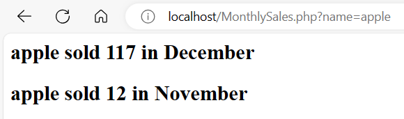
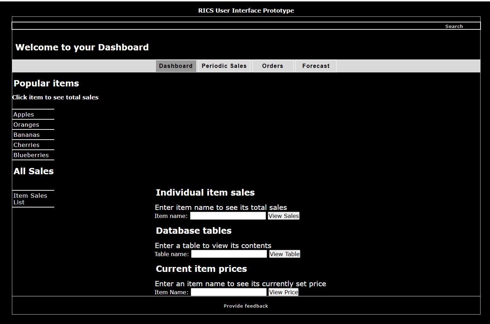

# Introduction
These are code samples from a Prototype Design for a Retail Inventory Control Software (RICS) - User Interface interactions with database programmed using SQL, PHP, HTML, and CSS. Tools included: MySQLworkbench, XAMPP Apache, Notepad++, Visual Studio Code. 

# SQL
## Code sample to calculate total revenue for each item sold per specified period
```
SELECT 
    s.item, 
    SUM(s.QTY * i.price) AS total_revenue
FROM 
    tmoral01dbm.sales s
INNER JOIN 
    tmoral01dbm.items i ON s.item = i.item_ID
WHERE 
    s.sale_date BETWEEN '2020-01-10' AND '2020-01-17'
GROUP BY 
    s.item;
```

# output


# PHP 
## Code sample to receive user input and return calculated result

```
<?php
# set up database parameters
$dbhost = 'mysql:host=mysqlsrv.dcs.bbk.ac.uk;dbname=tmoral01dbm';
$dbuser = 'tmoral01';
$dbpass = 'bbkmysql';

$db = new PDO($dbhost, $dbuser, $dbpass);

#Receive user inputs
$item = $_GET['item_name'];
$month_name = $_GET['month'];

### Convert month name to month number because the database date column is yyyy/mm/dd 
$month_number = date('m', strtotime($month_name));

$query = "SELECT SUM(s.QTY) AS Total_sold, i.item_name, i.item_ID
              FROM sales s
              JOIN items i ON s.item = i.item_ID
              WHERE i.item_name = ? AND MONTH(s.sale_date) = ?
              GROUP BY i.item_ID";

# prepare SQL statement 
$stmt = $db->prepare($query);
### Execute SQL statement using item and month number 
$stmt->execute([$item, $month_number]);
### Fetch results 
$result = $stmt->fetch();

### If the data exists then return it otherwise, print No sales found...
if ($result) {
    $total_sold = $result['Total_sold'];
    $item_name_result = $result['item_name'];
    print "<h2>A total of $total_sold of $item sold in $month_name</h2>";
} 
else {
    print "<p>No sales found for $item in $month_name</p>";
}

$db = null; // close connection
?>
``` 
#PHP Output 



# HTML 
## Dashboard code sample for RICS UI
```
<!-- Specifying the document type and version of HTML used --> 
<!DOCTYPE html> 

<!-- Specifying the language of the content as English --> 
<html lang="en">
<!-- The head section -->
<head>
	<!-- Unicode Transformation Format --> 
    <meta charset="UTF-8">

    <!-- Title of page-->
    <title>RICS Prototype</title>
	
    <!-- Stylesheets for design styles -->
    <link rel="stylesheet" href="styles/rics.css">
    <link href="https://fonts.googleapis.com/css?family=Source+Sans+Pro" rel="stylesheet">
</head>
<!-- End of head section --> 

		<!-- Main body !--> 

		<body> 
			<!-- This title shows up at the top of the page --> 
			<h4> RICS User Interface Prototype </h4>
			
			<!-- Division element used to structuring the page --> 
			<div id="pagewrapper">
			
				<!-- Headerlinks for search box-->
					<section> 
						<nav id="headerlinks">
							<ul>
								<li><a href="#">Search</a></li>
							</ul>
						</nav>
					</section> 
						
					<!-- Header for introduction -->
					<header>
						<h2> Welcome to your Dashboard </h2>
					</header>
						
					<!-- Primary navigation !-->		
					<nav id="primarynavigation">
						<ul>
							<li><a href="#" class="current">Dashboard</a></li>
							<li><a href="PeriodicSales.html">Periodic Sales</a></li>
							<li><a href="Orders.html">Orders</a></li>
							<li><a href="Forecast.html">Forecast</a></li>
						</ul>
					</nav>
						
						
					<!-- See Individual Item Sales -->
					<h2> Popular items </h2>
					<h3> Click item to see total sales </h3> 
					<!-- Secondary navigation left column!-->
						<div id="leftcol">
							<nav id="secondarynavigation">
								<ul>
									<li><a href="applesales.php">Apples</a></li>
									<li><a href="orangesales.php">Oranges</a></li>
									<li><a href="bananasales.php">Bananas</a></li>
									<li><a href="cherrysales.php">Cherries</a></li>
									<li><a href="blueberrysales.php"> Blueberries </a> </li> 
								</ul>
							</nav>
						</div>
						
						<h2> All Sales</h2>
						<div id="leftcol">
							<nav id="secondarynavigation">
								<ul>
									<li><a href="TotalSales.php">Item Sales List</a></li>
								</ul>
							</nav>
						</div>
						
					
					<div id="rightcol">
						<section> 		

							<!-- Total sales per item -->
							<h2> Individual item sales </h2> 
							<p> Enter item name to see its total sales</p> 
							<form action="ItemSales.php" method="get">
								Item name: <input type="text" name="item_name">
								<input type="submit" value="View Sales"> 
							</form>
							

							<!-- Form for viewing a table -->
							
							<h2> Database tables </h2> 
							<p>Enter a table to view its contents</p> 

							<form action="Table.php" method="get">
							Table name: <input type="text" name="tablename">
							<input type="submit" value="View Table">
							</form>

							<!-- Find item price -->
							<h2> Current item prices </h2> 
							<p>Enter an item name to see its currently set price </p> 
							<form action="GetItemPrice.php" method="get">
								<label for="item_name">Item Name:</label>
								<input type="text" id="item_name" name="item_name">
								<input type="submit" value="View Price">
							</form>
						</section> 
					</div> 
					
		<!-- Footer -->
				<footer>
					<nav id="footerlinks">
						<ul>
							<li><a href="feedback.html"> Provide feedback </a></li>
						</ul>
					</nav>
				</footer>
		
			</div>
		</body>
</html>
```
## Dashboard Output 


# CSS stylesheet 
## Primary navigation CSS code sample for the Menu options
```
/* Primary navigation menu */

#primarynavigation {
	background-color:#d9d9d9; /*set background colour of the primary navigation menu to light grey*/
	text-align: center; /* set the text to be centered horizontally within the container */
	margin: 0; /* removing default margin */
    padding: 0; /* removing any default padding */ 
}

#primarynavigation li { /* Primary navigation list of pages */
	list-style: none; /* Remove default style bullet points or numbers */
	display: inline-block; /* Make the elements display horizontally */
}

#primarynavigation a { /*For the primary navigation anchors (hyper-links) */
    text-decoration: none; /* remove default decoration */ 
	text-align: center; /* ensure the text sits centered horizontally in container */
	min-width: 100px; /* set minimum width */
	font-family: sans-serif; /* Specify the font family */
    font-weight: bold; /* Set text to bold */
    color: #000000; /* Set text color to black */
    padding: 0.5rem; /* Pad out the anchor elements */
    display: inline-block; /* Make the elements display horizontally */
    border: 1px solid #ffffff; /* Create a solid white border */
    letter-spacing: 0.09rem; /* Adjust letter spacing */
}


#primarynavigation a:hover,#secondary a:hover { /*Make the colour of the website tabs change when the mouse hovers over it */
	color: #0000FF ;
}

#primarynavigation .current { /* Change the background colour of the tab which the user is currently on */ 
	background-color:rgb(153, 153, 153); /*Use darker grey colour than original background colour */ 
}
```
